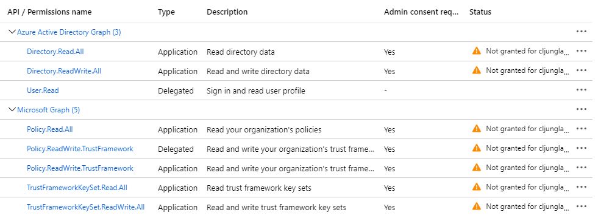

# AzureAD-B2C-scripts

This github repo contains a set of powershell script that help you to quickly setup an Azure AD B2C tenant and Custom Policies. If you are to set up a B2C tenant, you need to follow the guide on how to [Create an Azure Active Directory B2C tenant](https://docs.microsoft.com/en-us/azure/active-directory-b2c/tutorial-create-tenant). This leaves you with a basic tenant, but in order to install the Custom Policies, described in the documentation page [Get started with custom policies in Azure Active Directory B2C](https://docs.microsoft.com/en-us/azure/active-directory-b2c/custom-policy-get-started?tabs=applications#custom-policy-starter-pack), there are quite a few steps to complete. Although it is not complicated, it takes some time and involves som copy-n-pase, flickering between documentation pages, before you can test your first login. The powershell scripts in this repo are created with the aim of minimizing the time from setting up a B2C tenant to your first login.

## Summary

With the scripts in this repository, you can create a fully functional B2C Custom Policy environment in seconds via the commands 

```Powershell
.\aadb2c-create-graph-app.ps1 -n "B2C-Graph-App"
.\aadb2c-policy-key-create.ps1 -KeyContainerName "B2C_1A_TokenSigningKeyContainer" -KeyType "RSA" -KeyUse "sig"
.\aadb2c-policy-key-create.ps1 -KeyContainerName "B2C_1A_TokenEncryptionKeyContainer" -KeyType "RSA" -KeyUse "enc"
.\aadb2c-create-ief-apps.ps1
md demo; cd demo
..\aadb2c-create-new-policy-project.ps1 -ConfigPath ..\b2cAppSettings.json -UploadSecrets $true
..\aadb2c-create-test-webapp.ps1 -n "Test-WebApp"
```

## Prerequisites

As mentioned, you need to [create your B2C tenant](https://docs.microsoft.com/en-us/azure/active-directory-b2c/tutorial-create-tenant) which involves creating the resource in [portal.azure.com](https://portal.azure.com)


After creating the tenant, you need to link it to your Azure Subscription


## Creating a powershell session to you B2C tenant

First, open a powershell command prompt and git clone this repo and change directory into it 
```Powershell
git clone https://github.com/cljung/AzureAD-B2C-scripts.git

cd AzureAD-B2C-scripts
```
Then, run the script [aadb2c-login.ps1](aadb2c-login.ps1). The ***yourtenant*** does not need to include .onmicrosoft.com since the script will fix that for you. It is basically a wrapper around the Cmdlet ***Connect-AzAccount -t {guid}*** that connects you to your tenant. You need to run this using the same account as you created the B2C tenant with as it as the only user that has access to the tenant at start.

```Powershell
.\aadb2c-login.ps1 -t "yourtenant"
```

## Create Client Credentials for scripting

Much of the scripting action done with your B2C tenant will require a quite powerfull App Registration with client_id and client_secret that you can use. The below script will register an App with the required permissions that you can use to deploy Custom Policies and Policy keys. The scripts outputs the ClientCredentials you need to copy-n-paste into your b2cAppSettings.json file. It also reminds you that you need to go into the portal and grant permission to the App.

```Powershell
.\aadb2c-create-graph-app.ps1 -n "B2C-Graph-App"
Getting Tenant info...
yourtenant.onmicrosoft.com
91b...78

Creating WebApp B2C-Graph-App...
AppID           4b7...10
ObjectID:       aa8...8e

Creating ServicePrincipal...
AppID           4b7...10
ObjectID:       9bd...fb

Creating App Key / Secret / client_secret - please remember this value and keep it safe
Copy-n-paste this to your b2cAppSettings.json file
"ClientCredentials": {
    "client_id": "aa8...8e",
    "client_secret": "ErX...nw="
}
setting ENVVAR B2CAppID=aa8..8e
setting ENVVAR B2CAppKey=ErX...nw=
Remeber to go to portal.azure.com for the app and Grant Permission
```



## Creating the Token Encryption and Signing Keys

The [create your B2C tenant](https://docs.microsoft.com/en-us/azure/active-directory-b2c/tutorial-create-tenant) then continues with that you need to create your token encryption and signing keys. This isn't the most tedious job and doing it by hand is quite fast, but if you want to automate it, the following two lines will do it for you. 

```Powershell
.\aadb2c-policy-key-create.ps1 -KeyContainerName "B2C_1A_TokenSigningKeyContainer" -KeyType "RSA" -KeyUse "sig"

.\aadb2c-policy-key-create.ps1 -KeyContainerName "B2C_1A_TokenEncryptionKeyContainer" -KeyType "RSA" -KeyUse "enc"
```

## Create the IdentityExperienceFramework and ProxyIdentityExperienceFramework apps

For B2C Custom Policies, there exists two special apps that helps the policy engine communicate with the tenant. The app IdentityExperienceFramework is registered as a webapp and ProxyIdentityExperienceFramework as a native client.
This is the second step after creating the keys and is explained in the docs under section [Register Identity Experience Framework applications](https://docs.microsoft.com/en-us/azure/active-directory-b2c/custom-policy-get-started?tabs=applications#register-identity-experience-framework-applications)

To automatically create the two apps, run the script [aadb2c-create-ief-apps.ps1](aadb2c-create-ief-apps.ps1). The script will automatically grant the permissions for the apps.

```Powershell
.\aadb2c-create-ief-apps.ps1
Getting Tenant info...
yourtenant.onmicrosoft.com

Creating WebApp IdentityExperienceFramework...
Creating ServicePrincipal...
AppID           0b8..95
ObjectID:       331..52

Creating NativeApp ProxyIdentityExperienceFramework...
Creating ServicePrincipal...
AppID           33c..ef
ObjectID:       5c8..c4

Granting Windows Azure Active Directory - User.Read  to IdentityExperienceFramework

@odata.context : https://graph.microsoft.com/beta/$metadata#oauth2PermissionGrants/$entity
clientId       : 331..52
consentType    : AllPrincipals
expiryTime     : 2022-05-04T09:49:29Z
id             : ytg..y0
principalId    :
resourceId     : 176..2d
scope          : User.Read
startTime      : 2020-05-04T09:49:29Z

Getting Tenant info...
Tenant:         yourtenant.onmicrosoft.com
Granting IdentityExperienceFramework - user_impersonation  to ProxyIdentityExperienceFramework
@odata.context : https://graph.microsoft.com/beta/$metadata#oauth2PermissionGrants/$entity
clientId       : 5c8..c4
consentType    : AllPrincipals
expiryTime     : 2022-05-04T09:49:31Z
id             : wiO..dk
principalId    :
resourceId     : 331..52
scope          : user_impersonation
startTime      : 2020-05-04T09:49:31Z

Granting Windows Azure Active Directory - user_impersonation User.Read  to ProxyIdentityExperienceFramework
@odata.context : https://graph.microsoft.com/beta/$metadata#oauth2PermissionGrants/$entity
clientId       : 5c8..c4
consentType    : AllPrincipals
expiryTime     : 2022-05-04T09:49:31Z
id             : wiO..y0
principalId    :
resourceId     : 176..2d
scope          : user_impersonation User.Read
startTime      : 2020-05-04T09:49:31Z
```

## Edit you b2cAppSettings.json file to configure what features you want

The config file [b2cAppSettings.json](b2cAppSettings.json) contains settings for your environment and also what features you would like in your Custom Policy. It contains the following elements

* top element - contains a few settings, like which B2C Starter Pack you want to use. The default is ***SocialAndLocalAccounts***

* ClientCredentials - the client credentials we are going to use when we do GraphAPI calls, like uploading the Custom POlicy xml files

* AzureStorageAccount - Azure Blob Storage account settings. You will need this if you opt-in to to UX customizaion as the html files will be stored in blob storage. 

* CustomAttributes - if you plan to use custom attributes, you need to specify which App Registration will handle the custom attributes in the policy. The default is the "b2c-extension-app"

* UxCustomization - If you enable this, the script will download the template html files from your B2C tenant into a subfolder called "html" and upload them to Azure Blob Storage. The policy file ***TrustFrameworkExtension.xml*** will be updated to point to your storage for the url's to the html

* ClaimsProviders - a list of claims provider you like to support. Note that for each you enable, you need to use the respective portal to configure your app and to copy-n-paste the client_id/secret into b2cAppSettings.json

If you just want to test drive the below step, enable the Facebook Claims Provider (Enable=true) and set the client_id + client_secret configuration values to something bogus, like 1234567890. Since Facebook is part of the Starter Pack to begin with, you need this to be enabled to be able to upload correctly. Later if you want to use Facebook, you can register a true app and change the key or you can remove the Facebook Claims Provider in the ***TrustFrameworkExtension.xml*** file.

## Automated deployment the of Custom Policy to your tenant

The script [aadb2c-create-new-policy-project.ps1](aadb2c-create-new-policy-project.ps1) loads the b2cAppSettings.json config file and then invokes the other scripts as needed. For instance, the first step is invoking [aadb2c-prep-starter-pack.ps1](aadb2c-prep-starter-pack.ps1) which downloads the starter pack files from github and modifies them so they reference your tenant. The policy ids are also changed so that the prefix name you use (default is the name of your folder - demo in my case) is added to your policy ids. B2C_1A_signup_signin becomes B2C_1A_demo_signup_signin, etc. This is quite handy since it stops you from overwriting each others policies during development.

When adding features to you configuration the file ***TrustFrameworkBase.xml*** is never changed, all work is done via editing ***TrustFrameworkExtensions.xml***. The script [aadb2c-add-claimsprovider.ps1](aadb2c-add-claimsprovider.ps1), which adds different Claims Providers, adds quite a lot of xml depending on how many providers you use. If you want UX Customization, the script [aadb2c-policy-ux-customize.ps1](aadb2c-policy-ux-customize.ps1) will copy the ContentDefinition elements from the Base file, modify them and insert them into the Extensions file. All is done as specified in the documentation, but the automated version means you have the policies ready in ~10 seconds rather than spending a hour editing the files. 

```Powershell
md demo
..\aadb2c-create-new-policy-project.ps1 -ConfigPath ..\b2cAppSettings.json -UploadSecrets $true
*******************************************************************************
* Configuration
*******************************************************************************
Config File    :        ..\b2cAppSettings.json
B2C Tenant     :        91b..78, yourtenant.onmicrosoft.com
B2C Client Cred:        4b7..10, B2C-Graph-App
Policy Prefix  :        demo
*******************************************************************************
* Downloading and preparing Starter Pack
*******************************************************************************
Tenant:         yourtenant.onmicrosoft.com
TenantID:       91b..78
Getting AppID's for IdentityExperienceFramework / ProxyIdentityExperienceFramework
Downloading https://raw.githubusercontent.com/Azure-Samples/active-directory-b2c-custom-policy-starterpack/master/SocialAndLocalAccounts/TrustFrameworkBase.xml to C:\Users\alice\src\B2C\scripts\demo\TrustFrameworkBase.xml
Downloading https://raw.githubusercontent.com/Azure-Samples/active-directory-b2c-custom-policy-starterpack/master/SocialAndLocalAccounts/TrustFrameworkExtensions.xml to C:\Users\alice\src\B2C\scripts\demo\TrustFrameworkExtensions.xml
Downloading https://raw.githubusercontent.com/Azure-Samples/active-directory-b2c-custom-policy-starterpack/master/SocialAndLocalAccounts/SignUpOrSignin.xml to C:\Users\alice\src\B2C\scripts\demo\SignUpOrSignin.xml
Downloading https://raw.githubusercontent.com/Azure-Samples/active-directory-b2c-custom-policy-starterpack/master/SocialAndLocalAccounts/PasswordReset.xml to C:\Users\alice\src\B2C\scripts\demo\PasswordReset.xml
Downloading https://raw.githubusercontent.com/Azure-Samples/active-directory-b2c-custom-policy-starterpack/master/SocialAndLocalAccounts/ProfileEdit.xml to C:\Users\alice\src\B2C\scripts\demo\ProfileEdit.xml
Modifying Policy file PasswordReset.xml...
Modifying Policy file ProfileEdit.xml...
Modifying Policy file SignUpOrSignin.xml...
Modifying Policy file TrustFrameworkBase.xml...
Modifying Policy file TrustFrameworkExtensions.xml...
*******************************************************************************
* Adding custom attributes app to AAD-Common Claims Provider
*******************************************************************************
Using b2c-extensions-app
Adding TechnicalProfileId AAD-Common
*******************************************************************************
* Adding Social IdPs
*******************************************************************************
Updating TechnicalProfileId Facebook-OAUTH
Getting Tenant info...
key created: B2C_1A_FacebookSecret
*******************************************************************************
* Uploading Custom Policies to B2C
*******************************************************************************
Tenant:         yourtenant.onmicrosoft.com
TenantID:       91b..78
Authenticating as App B2C-Graph-App, AppID 4b7...10
Uploading policy B2C_1A_demo_TrustFrameworkBase...
91b..78
Uploading policy B2C_1A_demo_TrustFrameworkExtensions...
91b..78
Uploading policy B2C_1A_demo_PasswordReset...
91b..78
Uploading policy B2C_1A_demo_ProfileEdit...
91b..78
Uploading policy B2C_1A_demo_signup_signin...
91b..78
```
The script [aadb2c-upload-policy.ps1](aadb2c-upload-policy.ps1), which is responsible for uploading the B2C Custom Policies, is smart enough to look through the inheritance chain between the different xml files and will upload them in the correct order, ie start with Base, continue with Extensions and then the rest.

## Test drive the Custom Policy

To test the Custom Policy you need to register a dummy webapp in the portal that you can use. This is described in the tutorial for how to register an app and can be found here under section [Register a web application](https://docs.microsoft.com/en-us/azure/active-directory-b2c/tutorial-register-applications?tabs=app-reg-preview#register-a-web-application).

To automatically provision the app, run this script

```Powershell
..\aadb2c-create-test-webapp.ps1 -n "Test-WebApp"
```

It will create a webapp that redirects to [https://jwt.ms](https://jwt.ms) so you can test the B2C policy

## After initial creation

After the initial creation and upload of the policies, you can continue to work with the policies

### To load the settings in a new Powershell command prompt

```Powershell
cd demo
..\aadb2c-env.ps1 -ConfigPath ..\b2cAppSettings.json
```

### To rewire the policies to another B2C tenant

This script updates all policy xml files with:
1. PolicyId and TenantId in the header
2. App guids user for custom attributes
3. App guids for IdentityExperienceFramework and ProxyIdentityExperienceFramework

```Powershell
cd demo
..\aadb2c-policy-set-tenant.ps1 -t "mynewtenant.onmicrosoft.com" -p $pwd.Path
```

### To upload the policies to B2C

```Powershell
..\aadb2c-upload-policy.ps1 -t "mynewtenant.onmicrosoft.com" -p "C:\path\to\my\policies"
```

or if the policies are in the current folder

```Powershell
..\aadb2c-upload-policy.ps1
```
