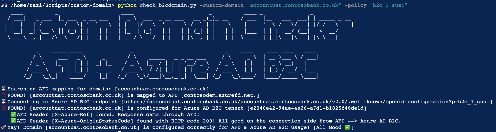
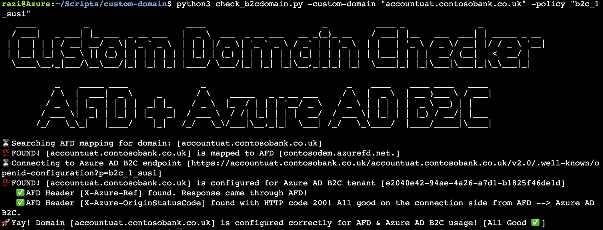

# Handy script which verifies custom domain configuration b/w AFD & Azure AD B2C. 

Details about custom domain feature are available at [Enable custom domains for Azure Active Directory B2C](https://docs.microsoft.com/en-us/azure/active-directory-b2c/custom-domain?pivots=b2c-user-flow)

## Prerequisite
* Python 3.0 or above. You can easily run the script by using [Azure Cloud Shell](https://shell.azure.com/).
* Azure AD B2C tenant with at least one userflow/custom policy. (e.g. b2c_1_susi). [Create userflow/custom policy](https://docs.microsoft.com/en-us/azure/active-directory-b2c/tutorial-create-user-flows?pivots=b2c-user-flow)
* Azure Front Door (AFD)

## Installation 
```
$ git clone https://github.com/azure-ad-b2c/Scripts.git
$ cd ./Scripts/custom-domain/
```

Install the required packages.
```
$ pip install -r requirements.txt
```

## Run the script
```
$ python check_b2cdomain.py -custom-domain "your.domain.name" -policy "b2c_1_policyname"
```

For example, running the script against ```accountuat.contosobank.co.uk``` domain will first verify the presense of CNAME entry to AFD instance. After that, it will make a request to Azure AD B2C endpoint and then examine the headers from the response to ensrue traffic is traveling back via AFD <--> Azure AD B2C.
```
$ python check_b2cdomain.py -custom-domain "accountuat.contosobank.co.uk" -policy "b2c_1_susi" 

⏳ Searching AFD mapping for domain: [accountuat.contosobank.co.uk]
💯 FOUND! [accountuat.contosobank.co.uk] is mapped to AFD [contosodem.azurefd.net.]
⏳ Connecting to Azure AD B2C endpoint [https://accountuat.contosobank.co.uk/accountuat.contosobank.co.uk/v2.0/.well-known/openid-configuration?p=b2c_1_susi]
💯 FOUND! [accountuat.contosobank.co.uk] is configured for Azure AD B2C tenant [e2040e42-94ae-4a26-a7d1-b1825f46de1d]
   ✅ AFD Header [X-Azure-Ref] found. Response came through AFD! 
   ✅ AFD Header [X-Azure-OriginStatusCode] found with HTTP code 200! All good on the connection side from AFD --> Azure AD B2C.
🚀 Yay! Domain [accountuat.contosobank.co.uk] is configured correctly for AFD & Azure AD B2C usage! [All Good ✅ ]
```
### Powershell



### Bash



## Troubleshooting

To view parameters use ``-h`` or ``--help`` swtich.
```
$ python check_b2cdomain.py -h  
```
To get more verbose information use ``-v`` or ``--verbose`` swtich.
```
$ python check_b2cdomain.py -custom-domain "accountuat.contosobank.co.uk" -policy "b2c_1_susi" --verbose
```
